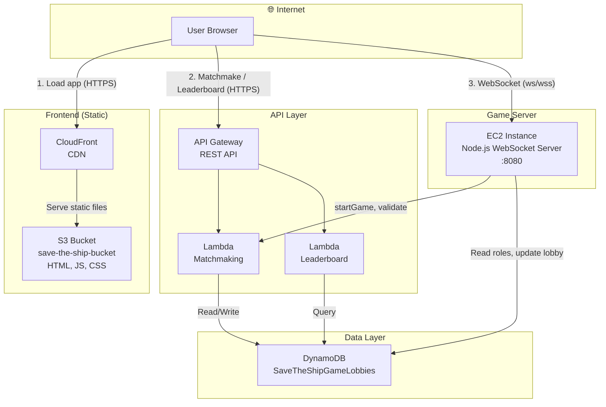

# SaveTheShip — AWS Architecture Diagram

## Mermaid Diagram



---

## Architecture Overview

| Component | AWS Service | Purpose |
|-----------|-------------|---------|
| **Frontend** | S3 + CloudFront | Static site (HTML, JS, CSS) |
| **Matchmaking API** | API Gateway + Lambda | Create/join lobbies, validate sessions |
| **Leaderboard API** | API Gateway + Lambda | Fetch game stats |
| **Game State** | DynamoDB | Lobby metadata, players, roles |
| **Game Server** | EC2 | WebSocket server for real-time gameplay |

---

## Data Flow

1. **Page load** — User → CloudFront → S3 (static files)
2. **Matchmaking** — User → API Gateway → Lambda → DynamoDB
3. **Game connection** — User → EC2 (WebSocket)
4. **Game start** — EC2 → Lambda (assign roles) → DynamoDB
5. **Leaderboard** — User → API Gateway → Lambda → DynamoDB

---

## Alternative: S3 Website (No CloudFront)

```
User → S3 Website Endpoint (HTTP) → Static files
User → API Gateway → Lambda → DynamoDB
User → EC2 (WebSocket)
```

---

## Region

All services deployed in **us-west-2** (Oregon).
